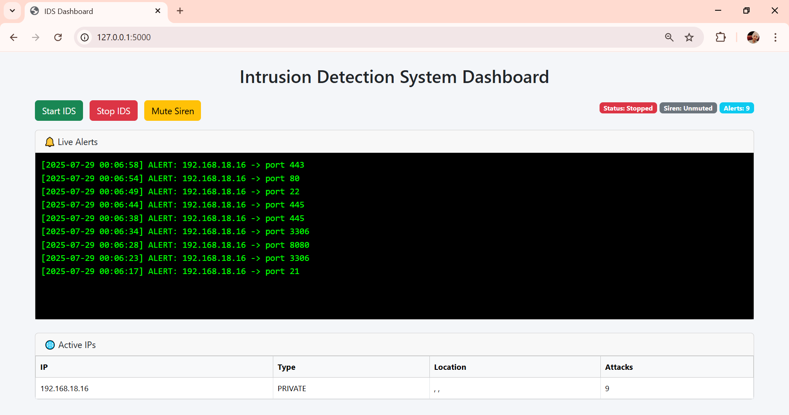

HEAD
# Intrusion-Detection-System
Python-based Intrusion Detection System with real-time alerts, GeoIP tracking, Flask dashboard, and more.

HEAD
# Intrusion-Detection-System
Python-based Intrusion Detection System with real-time alerts, GeoIP tracking, Flask dashboard, and more.

# 🛡️ Intrusion Detection System (IDS)

This project is a **Python-based Intrusion Detection System (IDS)** that monitors real-time network traffic to detect suspicious activities like TCP port scans, Web Directory Enumerations etc. It logs alerts, plays sirens, sends emails, and identifies the source using GeoIP lookup — all built with modular, multi-threaded components.

## 📌 Project Info

- **Student:** Sushil Singh  
- **University:** I.K. Gujral Punjab Technical University, Amritsar Campus  
- **Semester:** 6th Semester Major Project  
- **Guide:** Dr. Vipul Sharma  
- **Title:** Intrusion Detection System using Python, Scapy, and Flask

## 🚀 Features

- ✅ **TCP Packet Sniffing** using Scapy
- ✅ Detects **port scan attempts** on sensitive ports
- ✅ Tracks **unique ports per attacker IP**
- ✅ **GeoIP lookup** to trace the attack origin (city, region, country, org)
- ✅ Sends **email alerts** for each suspicious event
- ✅ Plays a **siren sound** on new detections (with threading)
- ✅ Logs all alerts with timestamp to `ids_alerts.txt`
- ✅ Skips alerts for:
  - Your system’s own IP
  - Trusted public cloud ranges (Google, AWS, etc.)
  - Repeated alerts from same IP on same port
- ✅ Graceful shutdown via `CTRL+C`
- ✅ Modularized code via:
  - `geoip_lookup.py`
  - `email_alert.py`
  - `enum_detector.py`

## 🛠️ Tech Stack

- **Python 3**
- **Scapy** – Packet analysis
- **Pygame** – Siren alert sound
- **Colorama** – Terminal color formatting
- **Requests** – GeoIP API lookup
- **Flask** *(optional - for dashboard)*
- Threading, Signal handling, Socket

## 📁 File Structure

Intrusion-Detection-System/
├── __pycache__/                     # Python bytecode cache (auto-created)
├── static/                          # Static assets for Flask (CSS, JS)
│   ├── script.js                    # JavaScript for dashboard (2 KB)
│   └── style.css                    # Dashboard styling (1 KB)
│
├── templates/                       # HTML templates for Flask
│   └── dashboard.html               # Dashboard frontend (3 KB)
│
├── app.py                           # Main Flask application
├── dashboard.py                     # Separate dashboard module (2 KB)
│
├── email_alert.py                   # Email alerting module
├── enum_detector.py                 # Main enum detection logic
├── enum_process.py                  # Subprocess for enum monitoring
├── geoip_lookup.py                  # IP geolocation API handling
│
├── http_enum_alerts.txt            # (Optional) Alert log file for enum
├── ids_alerts.txt                  # Main alert log file (auto-generated)
│
├── main.py                          # Main IDS scanner code
├── main_process.py                  # Background scanning or monitor
│
├── README.md                        # Project documentation
├── requirements.txt                 # Python dependencies
├── siren.mp3                        # Alert sound file (676 KB)

## ⚙️ How to Use

### 🔹 Clone the Repo

bash
git clone https://github.com/SushilSingh65/Intrusion-Detection-System
cd Intrusion-Detection-System

🔹 Install Requirements

pip install -r requirements.txt

🔹 Run the IDS

python app.py

🔒 If using on Linux, use sudo:

sudo python3 app.py

## 📸 Dashboard Screenshot

📜 License
This project is built for educational use only. Unauthorized use of network monitoring or scanning may be illegal. Always take permission before testing on any network.

👤 Contact
📧 Email: sm6815765@gmail.com 
📍 IKGPTU, Amritsar Campus

